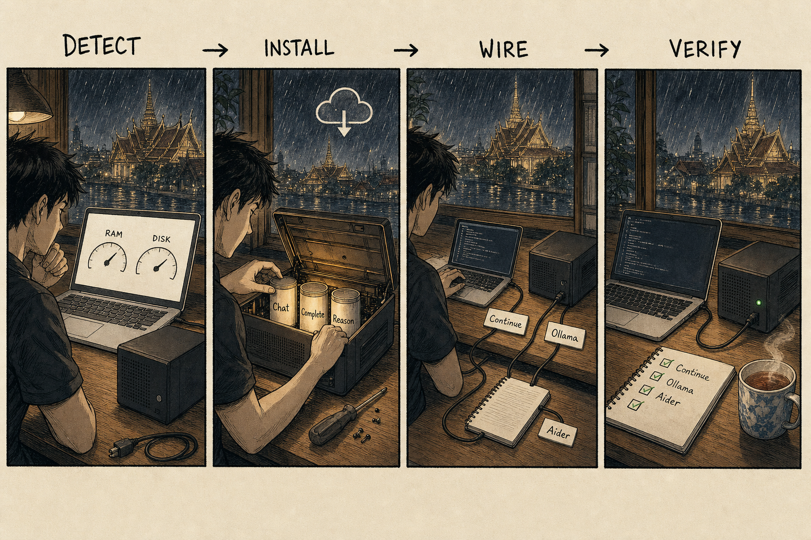
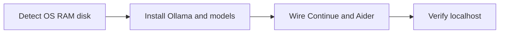
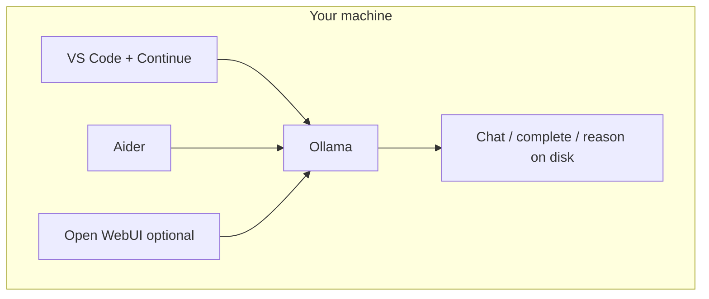
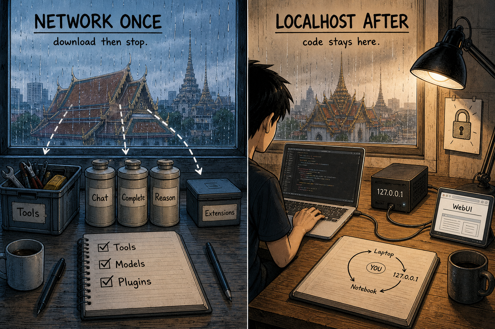
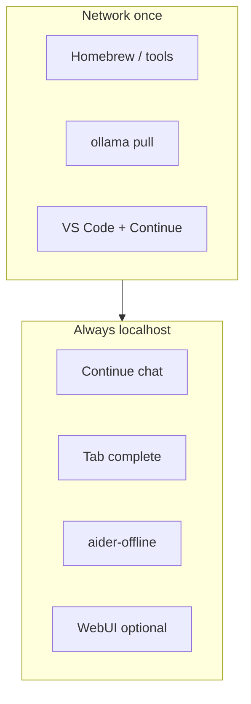

<p align="center">
  
</p>

<p align="center"><em>Studio banner — one Mac, a local box, a civic desk at night. Illustration only; not a screenshot of the installer or any product UI.</em></p>

# Offline AI Coding

**โค้ดด้วย AI บนเครื่องตัวเอง** · Code with AI on hardware you own.

[](LICENSE)
[](SECURITY.md)
[](SECURITY.md)

By [Non Arkaraprasertkul (Nonarkara)](https://github.com/Nonarkara) — [Axiom X Co., Ltd.](https://axiom.nonarkara.org), Bangkok.

**ไทย / English.** ยินดีต้อนรับ — สคริปต์สาธารณะนี้ติดตั้งสแต็กเขียนโค้ดด้วยโมเดลเปิดน้ำหนักบนเครื่องที่คุณควบคุม ใช้อินเทอร์เน็ตครั้งเดียวเพื่อดาวน์โหลด จากนั้นแชทและเติมโค้ดวิ่งที่ `localhost` ไม่มีเดโมบนคลาวด์ ไม่มีบัญชีผู้ขาย

Welcome — this public installer stands up open-weight coding models on a machine you control. Network **once** to download. After that, chat and complete stay on `localhost`. There is no hosted demo and no vendor account.

**[Quick start](QUICKSTART.md)** · **[What success looks like](#what-success-looks-like)** · **[Hardware](docs/HARDWARE.md)** · **[Privacy & safety](SECURITY.md)** · **[Off the grid](OFF-THE-GRID-GUIDE.md)** · **[Troubleshooting](TROUBLESHOOTING.md)** · **[Diagrams](#diagrams)**

This repository is an installer and a method. After the first download it does not need the internet. Fork the method. Do not expect secrets, API keys, or a live URL.

> **Before the rules — [`BUILDER.md`](BUILDER.md): how this repository expects you to work.**
> Build something rough enough to tear apart. Imagine a human doing the job before you
> prompt an agent to do it. Give the agent the real source material, not a description of
> it. Test, because a hypothesis proves nothing. Have a second, different agent look for
> the flaw. The law in this repository is the floor, not the work.

---

## What this is

A public setup for coding with open-weight models **on your own computer** — VS Code chat, tab autocomplete, and a terminal agent — without a monthly token bill and without sending your repo to a vendor.

`install.sh` detects OS, architecture, RAM, and free disk, then installs and wires:

| Piece | Role | After setup |
|-------|------|-------------|
| **Ollama** | Local model runtime (auto-start on boot where the installer can set it) | `http://127.0.0.1:11434` |
| **Chat / complete / reason models** | Sized from your RAM — see [Hardware tiers](#hardware-tiers) | Files under `~/.ollama` |
| **VS Code + Continue.dev** | Editor chat (`Cmd+L` / `Ctrl+L`) and tab complete | Configured for localhost; telemetry off |
| **Aider** | Terminal agent via the `aider-offline` alias | Talks to the same local models |
| **Open WebUI** | Optional browser chat (`webui-start`) | `http://localhost:8080` |
| **Kyutai Pocket TTS** | Optional offline voice (`speak`) | Skipped unless you say yes |

It also repairs the shell `PATH` — the usual cause of “command not found” in [TROUBLESHOOTING.md](TROUBLESHOOTING.md).

**This repo is not** a hosted coding assistant, a model zoo with private weights, a ranking of tools, or Claude / Copilot / Cursor. It is the **method**: hardware detection, public model IDs, and the scripts that connect them.

Related studio notes: [dr-non-openclaw-setup](https://github.com/Nonarkara/dr-non-openclaw-setup) (a gateway you own) · [live-coding-bible](https://github.com/Nonarkara/live-coding-bible) (civic dashboard playbook).

---

## Privacy and safety (read this first)

Security is the front door, not an appendix. Full checklist: **[SECURITY.md](SECURITY.md)**.

| Promise | What that means |
|---------|-----------------|
| **Internet once** | The one-liner needs the network to fetch Homebrew/Ollama, model weights, and extensions. After that, the stack is on-box. |
| **Localhost after** | Continue is written with `apiBase: http://localhost:11434`. Chat, complete, Aider, and optional WebUI should not leave the machine. |
| **Telemetry off** | The installer sets `allowAnonymousTelemetry: false` in `~/.continue/config.json`. |
| **No keys in this tree** | There is nothing to hoard: no tokens, no private endpoint, no “enterprise edition.” If a step needs a secret, it does not belong in a PR. |
| **Model licences ≠ MIT** | [LICENSE](LICENSE) covers **these scripts and docs**. Qwen, Gemma, DeepSeek, Ollama, VS Code, Continue, Aider, WebUI, and Pocket TTS keep their own terms. Read them before commercial use. |
| **Review generated code** | A local model is still a model. Read the diff. Do not merge what you have not understood. |
| **Do not call the cloud “offline”** | Pointing the same editor at a hosted API is a different product. Keep that path out of this method, or label it online. |

`.gitignore` already ignores `.env`, keys, `.continue/`, `.ollama/`, and Aider local state. Do not force-add them.

---

## Hardware tiers

**Best path today:** macOS (Apple Silicon is where the notes are strongest — unified memory). Ubuntu 22.04+ and Windows 11 WSL2 are listed as in progress — try them, file what breaks.

**Minimum:** 8 GB RAM, a current CPU, tens of GB free (the installer warns under 40 GB). **Comfortable:** 32 GB+ Apple Silicon. Machine-by-machine notes: [docs/HARDWARE.md](docs/HARDWARE.md).

The installer picks sizes from RAM. Mapping lives in `install.sh`, not a hidden score.

| RAM | Chat | Autocomplete | Reasoning | About |
|-----|------|--------------|-----------|--------|
| 64 GB+ | `qwen2.5-coder:32b` | `qwen2.5-coder:7b` | `deepseek-r1:14b` | Largest chat + stronger reasoner |
| 32 GB | `qwen2.5-coder:32b` | `qwen2.5-coder:7b` | `deepseek-r1:7b` | Same chat, smaller reasoner |
| 16 GB | `qwen2.5-coder:14b` | `qwen2.5-coder:7b` | `deepseek-r1:7b` | Tight but usable |
| 8 GB | `gemma4:e4b` | `qwen2.5-coder:3b` | `deepseek-r1:1.5b` | Gemma 4 E4B (~4.5B active) instead of a dense 7B; needs Ollama 0.22+ |
| under 8 GB | installer exits | | | Too small for this method |

8 GB uses Gemma 4 E4B because MatFormer nesting fits the budget better than another dense 7B. You can add models later with `ollama pull`. Speeds in HARDWARE.md are studio observations, not a league table.

---

## One-command path

Needs network **this once**:

```bash
bash <(curl -fsSL https://raw.githubusercontent.com/Nonarkara/offline-ai-coding/main/install.sh)
```

Or clone and run (same script):

```bash
git clone https://github.com/Nonarkara/offline-ai-coding.git
cd offline-ai-coding
chmod +x install.sh
./install.sh
```

Then open a **new** terminal so `PATH` and aliases load.

What the script does, in order: **detect** hardware → fix `PATH` → Homebrew → Ollama (upgrade if Gemma 4 needs 0.22+) → **install** models → VS Code if missing → **wire** Continue.dev + `~/.continue/config.json` + Aider + `aider-offline` → optional Open WebUI → optional Pocket TTS → **verify**.

Downloads dominate the wait (on the order of half an hour). Re-run if a pull drops; already-present models are skipped.

`install.sh` is the current installer. Older copies in the tree (`setup-offline-coding.sh`, `install-main.sh`, `start-coding.sh`, `fix-continue-config.sh`) are helpers — do not start there.

Worked first session: **[QUICKSTART.md](QUICKSTART.md)**. Mac-oriented narrative: [OFF-THE-GRID-GUIDE.md](OFF-THE-GRID-GUIDE.md).

---

## What success looks like

Do this before you decide “it failed.” Full checker: `bash scripts/verify.sh`.

| Check | Command / action | You should see |
|-------|------------------|----------------|
| 1. New shell | Close Terminal, open a new one | `aider-offline` is a known alias |
| 2. Ollama is up | `ollama list` | Your tier’s chat / complete / reason IDs |
| 3. Loopback API | `curl -sf http://localhost:11434/api/tags` | JSON listing those models |
| 4. Continue is local | `grep -E 'apiBase|allowAnonymousTelemetry' ~/.continue/config.json` | `http://localhost:11434` and `false` |
| 5. Scripted verify | `bash scripts/verify.sh` | Core tools + models + config pass (Gemma counts on the 8 GB tier) |
| 6. Editor chat | VS Code → **Cmd+L** / **Ctrl+L** → “Reply with: I am working locally.” | A short local reply, not a login wall |
| 7. Tab complete | Type a function in a file | A suggestion you can accept with Tab |
| 8. Optional agent | `cd` into a git repo → `aider-offline` | Aider starts against the local chat model |

If a row fails, jump to [TROUBLESHOOTING.md](TROUBLESHOOTING.md) — do not paste API keys to “fix” it.

Optional live model pings (needs the models downloaded): `bash scripts/selftest.sh`.

---

## Diagrams

Three pictures, then the same facts as mermaid for readers who prefer text.

### Install flow — detect → install → wire → verify

<p align="center">
  
</p>



### Local stack — everything talks to Ollama

<p align="center">
  
</p>



### Network once vs localhost after

<p align="center">
  
</p>



Everything after install is on-box. No studio backend.

---

## Philosophy

Written for learners who land from the [Nonarkara](https://github.com/Nonarkara) profile — **Thai and English** readers equally. The studio is one desk in Bangkok, not a platform company.

1. **Fork the method, not the secrets.** The value is the installer, the RAM tiers, and the local wiring. If you take the scripts and ship a better stack, that is the point.
2. **One Mac.** The intended home is a single machine you own. The same scripts also try Linux and mention Windows via WSL2; those paths are still being proven. You do not need a cluster.
3. **No black-box rankings.** The installer does not sell a league table. It picks sizes from RAM and writes the IDs into Continue and Aider. If a smaller box gets Gemma 4 E4B instead of Qwen 7B, the reason is in `install.sh`.
4. **Own the tools; rent nothing after setup.** Models on disk cannot be repriced or withdrawn the way an API can.
5. **Clear instructions beat a demo.** Step-by-step, as if the reader is new. Knowledge is not the paywall.

Company of record: **Axiom X Co., Ltd.** Author: **Non Arkaraprasertkul (Nonarkara)**. This public repo is studio method, not a billed Axiom product. It is not an official depa / municipal / UN tool.

---

## Ethical use

Treat this as a **local workshop**, not a substitute for judgment, and not a license to dump other people’s work into a model you do not control.

**Do**

- Keep the stack on **localhost** after setup.
- Read each model’s own licence before commercial use.
- Review generated code.
- Leave credentials out of git.
- Say so if you publish a fork. Do not present a restyled installer as the official Nonarkara stack.

**Do not**

- Treat “offline forever” as “never download again” during the **first** install.
- Invent a live product URL, a leaderboard, or a quality score this repo does not measure.
- Commit API keys, tokens, or someone else’s Continue/Ollama user config.
- Imply this is Claude, Copilot, or Cursor.
- Point the same machine at a cloud provider and call the result “offline.”

If a contribution only works by pasting a secret, it does not belong here.

---

## Daily loop

1. Ollama should already be up (menu bar app, `brew services`, or `ollama serve`).
2. Open a project in VS Code → **Cmd+L** / **Ctrl+L** → ask in plain language. Tab accepts complete.
3. Or: `cd` into a git repo and run `aider-offline`.
4. Optional: `webui-start` then `http://localhost:8080`. Optional: `speak --text "…" --voice default`.
5. Work offline. Push when you are back on a network.

---

## How the files fit

Strangers should not have to guess which README is real.

| Start here | Depth (do not delete) | Pointers only (old duplicates) |
|------------|------------------------|--------------------------------|
| [README.md](README.md) (this page) | [QUICKSTART.md](QUICKSTART.md) | [REPO_README.md](REPO_README.md) → here |
| [SECURITY.md](SECURITY.md) | [OFF-THE-GRID-GUIDE.md](OFF-THE-GRID-GUIDE.md) | [QUICKSTART_REPO.md](QUICKSTART_REPO.md) → QUICKSTART |
| [LICENSE](LICENSE) | [TROUBLESHOOTING.md](TROUBLESHOOTING.md) | [TROUBLESHOOTING_REPO.md](TROUBLESHOOTING_REPO.md) → TROUBLESHOOTING |
| `install.sh` | [docs/HARDWARE.md](docs/HARDWARE.md) | [GITHUB_REPO_STRUCTURE.md](GITHUB_REPO_STRUCTURE.md) → map of this tree |
| `scripts/verify.sh` | `scripts/selftest.sh`, `scripts/fix-path.sh` | |

---

## License / contributing

[MIT](LICENSE) — SPDX: `MIT`. Copyright © 2026 **Non Arkaraprasertkul / Axiom X Co., Ltd.**

GitHub should detect this file as **MIT License**. The grant covers this repository’s scripts and documentation. Ollama, VS Code, Continue.dev, Aider, Open WebUI, Pocket TTS, and each model keep their own licences.

Help that is actually useful: Linux and WSL2 test reports, GPU notes (CUDA / ROCm), translations, and clearer docs. See [CONTRIBUTING.md](CONTRIBUTING.md). Bug reports: what you ran, the exact error, RAM / CPU / OS, `ollama list`, and `echo $PATH`. Never paste a key.

The hero and diagrams in `docs/` are studio illustration for this README, not a data product.

If this setup lets you work without a token meter, teach the next person. If you build on the method, say so — the studio wants to see it.
