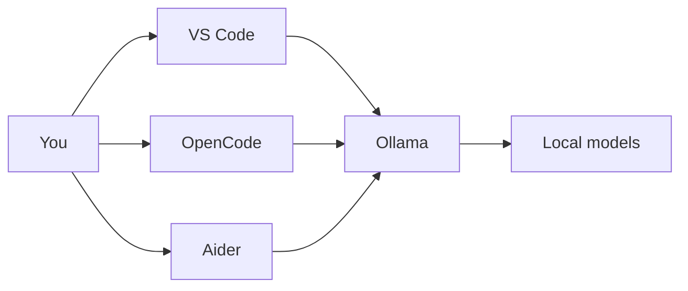
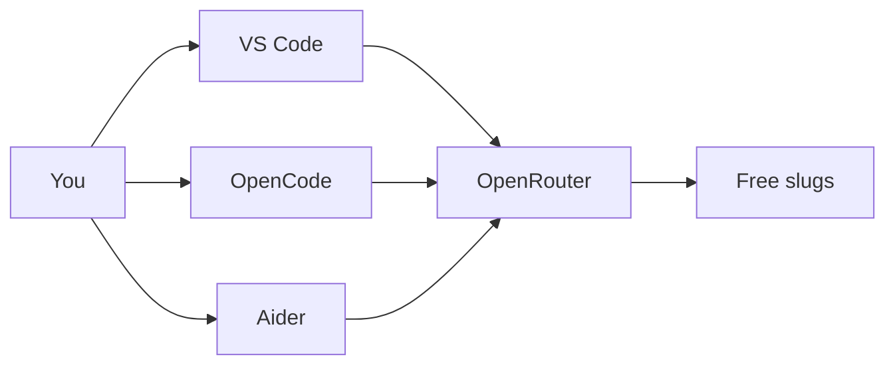
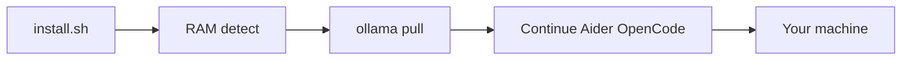

<p align="center">
  
</p>

<p align="center"><em>Studio banner for this public repo — one Mac, local models, a civic studio at night. Illustration only; not a screenshot of the installer.</em></p>

# Offline AI Coding

**โค้ดด้วย AI บนเครื่องตัวเอง** · Code with AI on hardware you own.

[](LICENSE)

By [Non Arkaraprasertkul (Nonarkara)](https://github.com/Nonarkara) — [Axiom X Co., Ltd.](https://axiom.nonarkara.org), Bangkok.

**[Quick start](QUICKSTART.md)** · **[Hardware](docs/HARDWARE.md)** · **[OpenCode](docs/OPENCODE.md)** · **[OpenRouter](docs/OPENROUTER.md)** · **[Guardrails](docs/GUARDRAILS.md)** · **[Off the grid](OFF-THE-GRID-GUIDE.md)** · **[Troubleshooting](TROUBLESHOOTING.md)**

This repository is an installer and a method: one command that stands up a **local** AI coding stack on a machine you control. After the first download it does not need the internet. There is no hosted demo and no cloud account.

---

## What this is

A public setup for coding with open-weight models **on your own computer** — VS Code chat, tab autocomplete, a terminal agent, and **OpenCode** — without a monthly token bill for the local path.

Two paths, both documented:

- **Local (default).** Ollama on `localhost`. After the first download this does not need the internet.
- **OpenRouter free models (optional, online).** Continue in VS Code, Aider CLI, and OpenCode `/connect`. Rate-limited. Prompts leave the machine. This is **not** offline.

`install.sh` detects OS, architecture, RAM, and free disk, then installs and wires:

| Piece | Role |
|-------|------|
| **Ollama** | Local model runtime (auto-start on boot where the installer can set it) |
| **Chat / complete / reason models** | Sized from your RAM (see [How to use](#how-to-use--learn)) |
| **VS Code + Continue.dev** | Editor chat (`Cmd+L` / `Ctrl+L`) and tab complete — local Ollama, optional OpenRouter |
| **Aider** | Terminal agent: `aider-offline` (local) or `aider-openrouter` (free cloud) |
| **OpenCode** | Optional TUI / desktop / IDE agent; same Ollama tags + `/connect` for OpenRouter |
| **Open WebUI** | Optional browser chat (`webui-start` → `http://localhost:8080`) |
| **Kyutai Pocket TTS** | Optional offline voice (`speak`); skipped unless you say yes |

It also repairs the shell `PATH` — the failure mode the troubleshooting notes treat as the usual “command not found” cause.

**This repo is not** a hosted coding assistant, a model zoo with private weights, or a ranking of tools. It is the **method**: hardware detection, public model IDs, example configs, and the scripts that connect them. Fork that. Do not expect secrets, API keys, or a live URL.

Internet is required **once** for the local stack (Homebrew/Ollama, models, extensions). OpenRouter is a **separate** online option. Related notes: [QUICKSTART.md](QUICKSTART.md), [docs/OPENCODE.md](docs/OPENCODE.md), [docs/OPENROUTER.md](docs/OPENROUTER.md), [docs/GUARDRAILS.md](docs/GUARDRAILS.md).

---

## Philosophy

Written for learners who land from the [Nonarkara](https://github.com/Nonarkara) profile — **Thai and English** readers equally. The studio is one desk in Bangkok, not a platform company.

1. **Fork the method, not the secrets.** The value is the installer, the RAM tiers, the OpenCode/Continue/Aider templates, and the local wiring. There is nothing to hoard: no tokens in this tree, no private endpoint, no “enterprise edition.” If you take the scripts and ship a better stack, that is the point.
2. **One Mac — in this studio, two that we actually use.** The intended home is a machine you own. Apple Silicon is where the notes are strongest. This studio’s daily boxes are an **M3 MacBook Air (16GB)** and an **M5 Max (128GB)** — same method, different RAM tiers. You do not need a cluster. A private LAN fabric between those two machines is **not** in this repo.
3. **No black-box rankings.** The installer does not sell a league table of models. It picks sizes from RAM and writes the IDs into Continue, Aider, and OpenCode. The mapping is in `install.sh`. OpenRouter’s `openrouter/free` router is *their* picker, not ours. If a smaller box gets Gemma 4 E4B instead of Qwen 7B, the reason is in that file (MatFormer nesting, Ollama 0.22+), not a hidden score.
4. **Own the tools; rent nothing after local setup.** Models on disk cannot be repriced or withdrawn the way an API can. Continue is configured with telemetry off. OpenRouter is optional rent: a free-tier quota, not ownership.
5. **Clear instructions beat a demo.** Step-by-step, as if the reader is new. Guardrails are public. Knowledge is not the paywall.

Company of record: **Axiom X Co., Ltd.** Author: **Non Arkaraprasertkul (Nonarkara)**. This public repo is studio method, not a billed Axiom product.

---

## Ethical use

Treat this as a **local workshop**, not a substitute for judgment, and not a license to dump other people’s work into a model you do not control.

**Do**

- Keep the **local** stack on **localhost**. After setup, chat and complete should hit Ollama on your machine (`http://localhost:11434`).
- If you turn on OpenRouter, say so in your own head: the prompt is no longer local. Do not paste `.env` files or client secrets into that chat.
- Read each model’s own licence (Qwen, Gemma, DeepSeek, OpenRouter slugs, and anything you `ollama pull` later) before commercial use. This repo’s MIT grant covers **these scripts and docs**, not upstream weights.
- Review generated code. A local model is still a model. A free cloud model is still a model.
- Leave credentials out of git. `.gitignore` ignores `.continue/`, `.ollama/`, `.env`, and OpenCode `auth.json`.
- Copy [`examples/AGENTS.md`](examples/AGENTS.md) into **your** project so OpenCode/Cursor see the same rules.
- Say so if you publish a fork. Do not present a restyled installer as the official Nonarkara stack.

**Do not**

- Treat “offline forever” as “never download again” during the **first** install — the one-liner needs the network.
- Invent a live product URL, a leaderboard, or a quality score this repo does not measure.
- Commit API keys, tokens, or someone else’s Continue/Ollama user config.
- Imply this is Claude, Copilot, or Cursor, or that it is an official depa / municipal / UN tool. It is independent studio work.
- Point the same machine at a cloud provider and call the result “offline.”
- Put `OPENROUTER_API_KEY` in `opencode.json`, `config.yaml`, or a commit.
- Burn the OpenRouter daily quota on **tab autocomplete** — keep complete on local Qwen.

If a contribution only works by pasting a secret, it does not belong here.

---

## How to use / learn

**Best path today:** macOS (Apple Silicon fully exercised in the notes; Intel tested with Rosetta). Ubuntu 22.04+ and Windows 11 WSL2 are listed as in progress — try them, file what breaks.

**Minimum:** 8 GB RAM, a current CPU, tens of GB free (the installer warns under 40 GB). **Comfortable:** 32 GB+ Apple Silicon. Exact tier tables: [docs/HARDWARE.md](docs/HARDWARE.md).

### Install

One-liner (needs network this once):

```bash
bash <(curl -fsSL https://raw.githubusercontent.com/Nonarkara/offline-ai-coding/main/install.sh)
```

Or clone and run:

```bash
git clone https://github.com/Nonarkara/offline-ai-coding.git
cd offline-ai-coding
chmod +x install.sh
./install.sh
```

Then open a **new** terminal so `PATH` and aliases load.

What the script does, in order: detect hardware → fix `PATH` → set `OLLAMA_CONTEXT_LENGTH` by RAM → Homebrew → Ollama (upgrade if Gemma 4 needs 0.22+) → pull models → VS Code if missing → Continue.dev JSON + YAML → Aider + `aider-offline` / `aider-openrouter` → optional OpenCode → optional Open WebUI → optional Pocket TTS → a short verify.

Downloads dominate the wait (the docs say on the order of half an hour). Re-run if a pull drops; already-present models are skipped. Already-installed users: `bash scripts/apply-studio-configs.sh` copies **missing** example configs only.

### RAM → models (`install.sh`)

| RAM | Chat | Autocomplete | Reasoning |
|-----|------|--------------|-----------|
| 64 GB+ | `qwen2.5-coder:32b` | `qwen2.5-coder:7b` | `deepseek-r1:14b` |
| 32 GB | `qwen2.5-coder:32b` | `qwen2.5-coder:7b` | `deepseek-r1:7b` |
| 16 GB | `qwen2.5-coder:14b` | `qwen2.5-coder:7b` | `deepseek-r1:7b` |
| 8 GB | `gemma4:e4b` | `qwen2.5-coder:3b` | `deepseek-r1:1.5b` |
| under 8 GB | installer exits | | |

8 GB uses Gemma 4 E4B because the script treats it as a better fit than another dense 7B on that budget. You can add models later with `ollama pull`.

**Studio machines (not a product spec):** M3 Air 16GB → 16GB row. M5 Max 128GB → 64GB+ row. Details and context-length traps: [docs/HARDWARE.md](docs/HARDWARE.md), [docs/GUARDRAILS.md](docs/GUARDRAILS.md).

### Daily loop — local

1. Ollama should already be up (menu bar app, `brew services`, or `ollama serve`). Quit and reopen the app once after install so `OLLAMA_CONTEXT_LENGTH` applies.
2. Open a project in VS Code → **Cmd+L** / **Ctrl+L** → ask in plain language. Tab accepts complete.
3. Or: `cd` into a git repo and run `aider-offline`.
4. Or: `opencode` then `/models` → an `ollama/…` tag.
5. Optional: `webui-start` then `http://localhost:8080`. Optional: `speak --text "…" --voice default`.
6. Work offline. Push when you are back on a network.

### Daily loop — OpenRouter free (online)

1. Key in `~/.continue/.env` **and** `export OPENROUTER_API_KEY` for CLI (VS Code cannot see zsh exports).
2. Continue: pick **OpenRouter …** in the model dropdown. Leave autocomplete on local Qwen.
3. `aider-openrouter` or `aider --model openrouter/google/gemma-4-31b-it:free`
4. OpenCode: `/connect` → OpenRouter → `/models`.
5. Expect 429s and a small daily cap. Full instructions: [docs/OPENROUTER.md](docs/OPENROUTER.md).

Worked examples: [QUICKSTART.md](QUICKSTART.md). OpenCode: [docs/OPENCODE.md](docs/OPENCODE.md). When something fails: [TROUBLESHOOTING.md](TROUBLESHOOTING.md), then `bash scripts/verify.sh`. Extra Mac-oriented narrative: [OFF-THE-GRID-GUIDE.md](OFF-THE-GRID-GUIDE.md). Other scripts in the tree (`setup-offline-coding.sh`, `install-main.sh`, `start-coding.sh`, `fix-continue-config.sh`) are older or helper copies — **`install.sh` is the current installer.** Example configs: [`examples/`](examples/).

---

## System diagram







Left chart: default, on-box. Middle chart: optional, **online**. No studio backend. Do not paste keys into git.

---

## License / contributing

[MIT](LICENSE). Copyright © 2026 **Non Arkaraprasertkul / Axiom X Co., Ltd.**

MIT covers this repository’s scripts and documentation. Ollama, VS Code, Continue.dev, Aider, OpenCode, Open WebUI, Pocket TTS, OpenRouter, and each model keep their own licences.

Help that is actually useful: Linux and WSL2 test reports, GPU notes (CUDA / ROCm), translations, and clearer docs. See [CONTRIBUTING.md](CONTRIBUTING.md). Bug reports: what you ran, the exact error, RAM / CPU / OS, `ollama list`, and `echo $PATH`.

The hero at `docs/hero-banner.png` is studio illustration for this README, not a data product.

If this setup lets you work without a token meter, teach the next person. If you build on the method, say so — the studio wants to see it.
